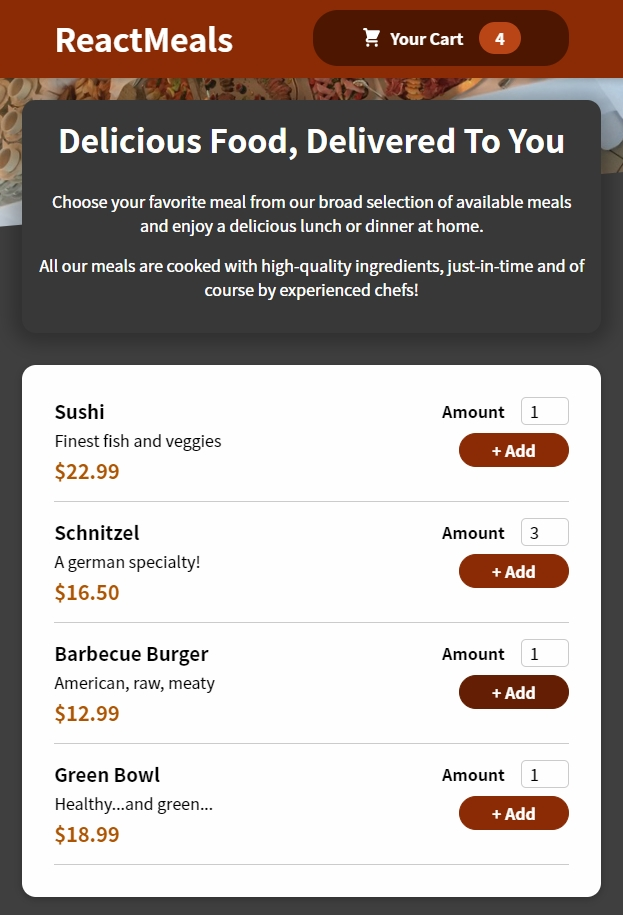

# Meals App :shallow_pan_of_food:

## Lessons Learned

- useReducer & useEffect & useRef Hooks
- Create Modal via a React Portal
- React Context API

## Demo

_[**Project**](https://meals-react-app.netlify.app/) created in a Udemy course of [React.js](https://www.udemy.com/course/react-the-complete-guide-incl-redux/)_
  
## Screenshot

